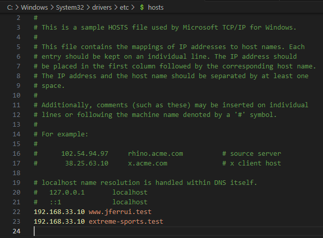
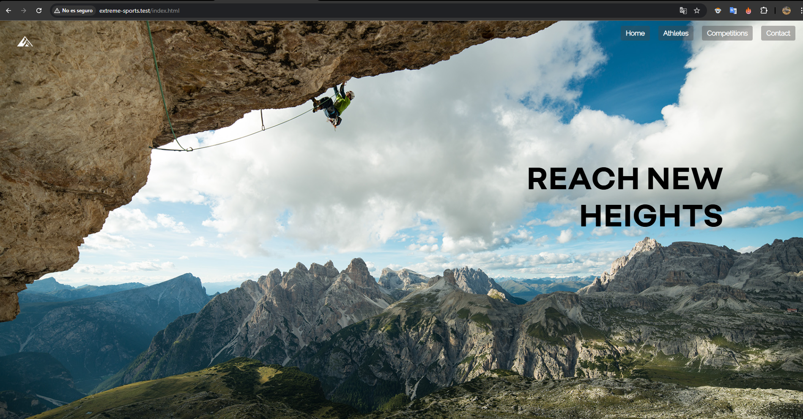
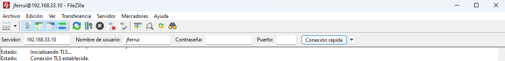
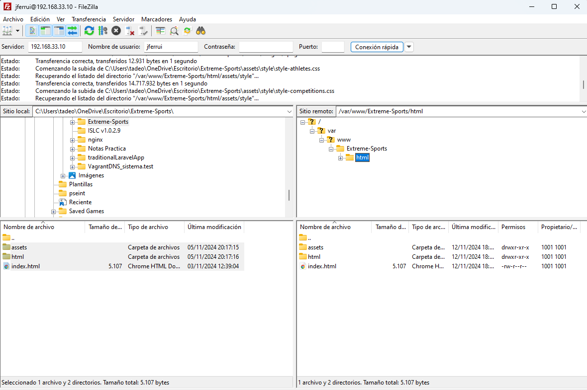

# NGINX

# Cuestiones finales

#### ¿Qué pasa si no hago el link simbólico entre sites-available y sites-enabled de mi sitio web?

En Nginx, la carpeta sites-available almacena las configuraciones de todos los sitios web configurados en el servidor, mientras que sites-enabled contiene los enlaces simbólicos (symlinks) que apuntan a los archivos de configuración de los sitios activados.

Si no se crea un enlace simbólico en sites-enabled que apunte al archivo de configuración en sites-available, Nginx no cargará dicha configuración cuando el servicio se reinicie. Esto implica que el sitio web que configuraste no estará accesible, y en su lugar se mostrará la página web por defecto (default).

En mi caso, tengo configurado server.test con una redirección de nombre en la IP 192.168.2.200. Sin el enlace simbólico, al acceder a server.test Nginx responderá con la página por defecto, en lugar del sitio que configuré bajo el nombre de server.test:

#### ¿Qué pasa si no hago el link simbólico entre sites-available y sites-enabled de mi sitio web?

Si la carpeta /var/www/nombre_web no tiene los permisos correctos, que en este caso deberían asignarse al usuario www-data, Nginx no podrá acceder a los archivos del sitio y devolverá un error 404 Not Found al intentar cargar la página:

### Descripción de los Archivos

1. **Vagrantfile**: Archivo de configuración de Vagrant. 
2. **provision.sh**: Script que uso para instalar y configurar el servidor web NGINX.
3. **vsftpd.conf**: Archivo que define varios parámetros que controlan cómo el servidor FTP opera.

---
### Redireccion de nombres
En el archivo local de ordeandor dentro de `C:\Windows\System32\drivers\etc\hosts` añado mi ip y mi servername

---

### Funcionamiento de las paginas WEB

Primer sitio web, transferencia de archivos realizada con GIT.

Segundo sitio web, transferencia de archivos realizada con FTP.

---

### Transferencia manual de archivos con FTP

Hago una conexion con mis credenciales en Filezilla:

Subo los archivos de mi Pag Web :

## Realizado por el Autor

**José Manuel Fernández Ruiz**  
Github: [github.com/Jferrui0803](https://github.com/Jferrui0803)  
